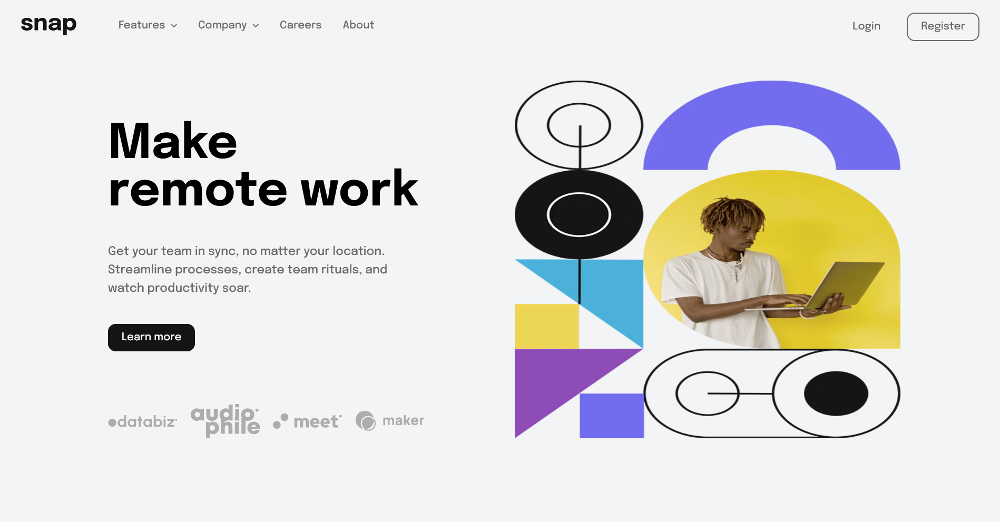

# Frontend Mentor - Intro section with dropdown navigation solution

This is a solution to the [Intro section with dropdown navigation challenge on Frontend Mentor](https://www.frontendmentor.io/challenges/intro-section-with-dropdown-navigation-ryaPetHE5). Frontend Mentor challenges help you improve your coding skills by building realistic projects. 

## Table of contents

- [Overview](#overview)
  - [The challenge](#the-challenge)
  - [Screenshot](#screenshot)
  - [Links](#links)
- [My process](#my-process)
  - [Built with](#built-with)
  - [What I learned](#what-i-learned)
  - [Useful resources](#useful-resources)
- [Author](#author)

## Overview

### The challenge

Users should be able to:

- View the relevant dropdown menus on desktop and mobile when interacting with the navigation links
- View the optimal layout for the content depending on their device's screen size
- See hover states for all interactive elements on the page

### Screenshot



### Links

- Live Site URL: [https://snapremotenextjs.netlify.app/](https://snapremotenextjs.netlify.app/)

## My process

### Built with

- Semantic HTML5 markup
- Flexbox
- TailwindCSS
- Mobile-first workflow
- [React](https://reactjs.org/) - JS library
- [Next.js](https://nextjs.org/) - React framework

### What I learned

In this project I had problem to scale icons using svgs tags in hero section. I was using them like they were provided. To solve this problem I have added viewBox attribute to svg element like this:

```html
    <svg className='w-full h-auto' width="114" height="20" viewBox='0 0 114 20' xmlns="http://www.w3.org/2000/svg">
```

Without viewBox property it doesn't work even there was set width to match full size

### Useful resources

- [How to scale svgs](https://www.youtube.com/watch?v=Clv_YhMWoFk) - this helped to properly scale svg tags. This is superb video that explains how to scale svg to parent element but also how viewBox attribute works.

## Author

- Website - [Mateusz Bizoń](https://portfoliomateuszbizon.netlify.app/)
- Frontend Mentor - [@mateuszbizon](https://www.frontendmentor.io/profile/mateuszbizon)